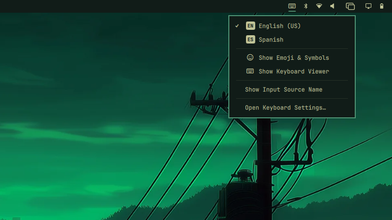

# Language Switcher for Omarchy

An input source menu for the [Omarchy](https://omarchy.org) bar. The bar shows
the active keyboard layout as a small badge (`EN`, `ES`). Click it for the Input
menu, or switch layouts from the keyboard. Ctrl+Space goes back to the source
you used before, and Ctrl+Alt+Space steps to the next one.
Plugin ID: `jesusarchive.language-switcher`. MIT licensed.



- The bar badge carries the layout's language code from xkb. Hover it for the
  full name ("Spanish"), or turn on "Show Input Source Name" to put the name in
  the bar as well.
- The Input menu lists every source with a ✓ on the active one, then "Show
  Emoji & Symbols" (Omarchy's emoji picker), "Show Input Source Name" and "Open
  Keyboard Settings…" (`~/.config/hypr/input.lua`).
- Ctrl+Space switches to the most recently used source and shows a switcher
  listing every source. Hold Ctrl and tap Space again while the switcher is up
  to move down the list.
- Ctrl+Alt+Space switches to the next source in order and shows a small
  indicator, with ⇪ while Caps Lock is on.
- Every keyboard switches together, so a second keyboard never stays on the old
  layout. The plugin ignores virtual keyboards and ACPI buttons.
- The badge and both overlays use Omarchy's menu colors and fonts.

## Install

```bash
omarchy plugin add https://github.com/jesusarchive/omarchy-language-switcher.git --enable
```

The widget lands in the right section of the bar. Move it with
`omarchy bar move jesusarchive.language-switcher --section <left|center|right>`.

Manual install from a checkout:

```bash
omarchy plugin validate .
mkdir -p ~/.config/omarchy/plugins/jesusarchive.language-switcher
rsync -a --delete --exclude .git ./ ~/.config/omarchy/plugins/jesusarchive.language-switcher/
omarchy plugin enable jesusarchive.language-switcher
```

Requirements: `hyprctl` and `xkbcli` (libxkbcommon). Both ship with Omarchy.

### Layouts

The plugin only moves between layouts you already have. List two or more in
`~/.config/hypr/input.lua`:

```lua
kb_layout = "us,es",
kb_variant = ",",
```

With a single layout the badge still shows, and switching does nothing. Turn on
`hideWhenSingle` to hide the badge instead.

### Keybindings

The plugin doesn't bind any keys. Add these lines to
`~/.config/hypr/bindings.lua`:

```lua
o.bind("CTRL + SPACE", "Previous input source", "omarchy-shell jesusarchive.language-switcher previous")
o.bind("CTRL + ALT + SPACE", "Next input source", "omarchy-shell jesusarchive.language-switcher next")
```

Hyprland reloads the file on save, and the bindings show up in Omarchy's
keybindings list (Super+K). Omarchy binds neither chord by default. Apps that
use Ctrl+Space, editor completion for example, stop receiving it.
To use other keys, change the first argument, for example `"SUPER + SPACE"`. If
Omarchy or another plugin already binds that chord, add `hl.unbind("SUPER + SPACE")`
on the line before, then check with `hyprctl configerrors`.

### Remove

```bash
omarchy plugin remove jesusarchive.language-switcher
```

Then delete the two bindings from `bindings.lua`.

## Use

| Where | Action |
|---|---|
| Bar: left click | open the Input menu |
| Bar: right click | switch to the next source |
| Menu: click a source | switch to it |

Keys while the menu is open:

| Key | Action |
|---|---|
| `j` / `k` / arrows | move |
| a letter | jump to the source whose name starts with it, except `j` and `k` |
| `Enter` | activate the selected row |
| `Tab` | next bar panel |
| `Esc` | close |

### Scripting

The plugin registers an IPC target:

```bash
omarchy-shell jesusarchive.language-switcher previous   # Ctrl+Space
omarchy-shell jesusarchive.language-switcher next       # Ctrl+Alt+Space
omarchy-shell jesusarchive.language-switcher set es     # by index, code (ES) or layout (es, us(intl))
omarchy-shell jesusarchive.language-switcher current    # prints the active code, e.g. EN
omarchy-shell jesusarchive.language-switcher list       # JSON of every source
omarchy-shell jesusarchive.language-switcher toggle     # open the menu on the focused monitor
omarchy-shell jesusarchive.language-switcher refresh
```

`previous` and `next` print the new code, or `single` when there's only one
source. `set` prints `unknown` for a source that doesn't exist.

## Settings

Edit these inline on the widget's entry in `~/.config/omarchy/shell.json`, or
in Omarchy's settings panel:

| Key | Default | Meaning |
|---|---|---|
| `showSourceName` | `false` | Show the layout name next to the badge |
| `showSwitcher` | `true` | Show the source list on Ctrl+Space. Turn it off to switch with no overlay |
| `showIndicator` | `true` | Show the small badge after Ctrl+Alt+Space or a menu pick |
| `hudTimeoutMs` | `900` | How long the switcher and indicator stay up (300 to 5000 ms) |
| `hideWhenSingle` | `false` | Hide the badge when you have only one layout |

## How it works

- `Service.qml` runs once for the whole shell. It reads `hyprctl -j devices`
  on start and on every `activelayout` and `configreloaded` event from
  Hyprland, owns the IPC target, and draws the overlays in `SwitchHud.qml`.
- Switching runs one detached `hyprctl switchxkblayout <keyboard> <index>` per
  typed keyboard. Each device name goes in its own argument, so no shell or
  batch separator can split it.
- With two or more layouts the service re-reads the device list every 10
  seconds, because plugging a keyboard in raises no Hyprland event. A
  single-layout install has nothing to switch, so the service skips the poll.
- Names and codes come from `xkbcli list`, read once at start. `es` becomes
  "Spanish" and `ES`. Two sources with the same code (`us` and `us(intl)`) get a
  variant letter so their badges differ.
- Ctrl+Space keeps a most-recently-used list, and a run of presses while the
  switcher is up counts as one use.
- `Widget.qml` is the bar badge and menu, one per monitor. It only renders what
  the service exposes.
- `Model.js` holds the parsing and switching logic with no Qt imports, so node
  can test it.

## Development

```bash
node --test tests/*.test.js               # model tests
omarchy plugin validate .                 # manifest check
rsync -a --delete --exclude .git ./ ~/.config/omarchy/plugins/jesusarchive.language-switcher/
omarchy restart shell                     # QML changes need a restart to show up
omarchy-shell jesusarchive.language-switcher list
```

Files:
- `manifest.json`
- `Service.qml`: the layout state, the switching and the IPC target
- `SwitchHud.qml`: the switcher and indicator overlays
- `Widget.qml`: the bar badge and the Input menu
- `SourceIcon.qml`: the badge drawing
- `Model.js`: the pure logic
- `tests/`: the node tests
- `preview.png`: the marketplace preview, also the image above

## License

MIT
