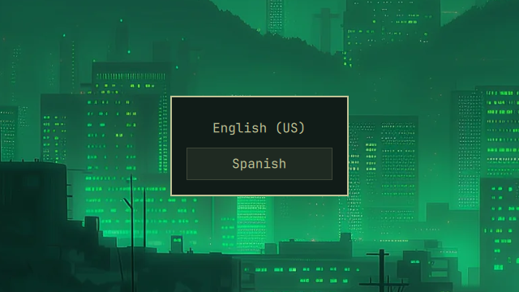
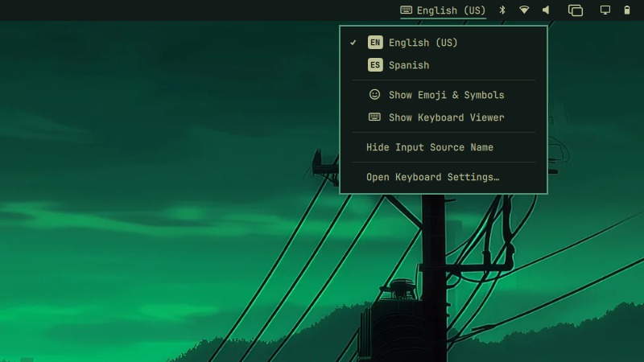
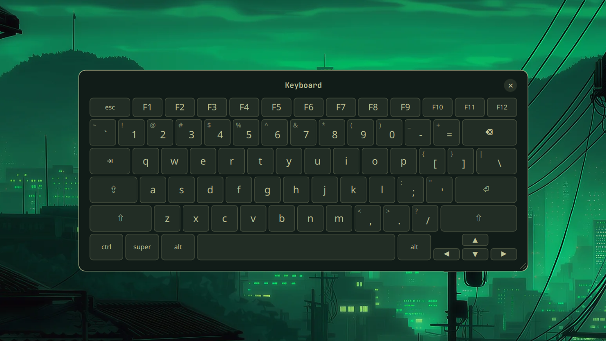

# Keyboard Layout Switcher

See your active input source in the Omarchy bar, switch layouts from its menu
or a shortcut, and optionally open a clickable keyboard viewer.

## Bar and menu

The bar shows an icon with a short code for the active layout. While the menu
is open, it shows a keyboard icon instead. If you enable the input source name,
the full name stays visible beside either icon.


Left or right click the indicator to open the menu. The active layout has a
check mark. Choosing a layout switches your keyboards together.


The menu also includes Emoji & Symbols, a source-name toggle, and an action to
open `~/.config/hypr/input.lua` in your editor. You can optionally add the
keyboard viewer to the menu. Use arrows or `j`/`k` to move, Enter or Space to
select, and Esc to close.

## Requirements

This plugin requires Omarchy Quattro with shell plugin support. Omarchy includes
the tools it uses: `hyprctl`, `xkbcli`, `wtype`, Python 3, and libxkbcommon.

## Installation

```bash
omarchy plugin add https://github.com/jesusarchive/omarchy-keyboard-layout-switcher.git --enable
```

## Keyboard layouts

The plugin switches between layouts configured in `~/.config/hypr/input.lua`.
For example:

```lua
kb_layout = "us,es",
kb_variant = ",",
```

With one layout, the indicator remains visible but there is nothing to switch.

## Shortcuts

The plugin does not install keybindings. Add these to
`~/.config/hypr/bindings.lua` if you want them:

```lua
o.bind("CTRL + SPACE", "Previous keyboard layout", "omarchy-shell jesusarchive.keyboard-layout-switcher previous")
o.bind("CTRL + ALT + SPACE", "Next keyboard layout", "omarchy-shell jesusarchive.keyboard-layout-switcher next")
```

Tap Ctrl+Space to return to the last used layout. Keep Ctrl held to show the
switcher, then press Space to cycle through the layouts. Ctrl+Alt+Space moves to
the next layout in the configured order.



Binding Ctrl+Space here takes it away from applications that use it. Change the
first argument to choose another chord. If that chord is already bound, use
`o.rebind` instead of `o.bind`.

## Bar options

The indicator starts in the right section of the bar. To move it:

```bash
omarchy bar move jesusarchive.keyboard-layout-switcher --section center
```

The default `barAppearance` is `icon`. Set it to `bordered` for an outlined
code or `text` for plain text. `showSourceName` adds the full layout name:

```bash
omarchy bar set jesusarchive.keyboard-layout-switcher barAppearance bordered
omarchy bar set jesusarchive.keyboard-layout-switcher showSourceName true --json
```



Set a menu row's key to `true` to show it or `false` to hide it:

| Key | Menu row | Default |
| --- | --- | --- |
| `showEmojiAndSymbols` | Show Emoji & Symbols | shown |
| `showKeyboardViewer` | Show Keyboard Viewer | hidden |
| `showSourceNameMenuItem` | Show Input Source Name | shown |
| `showKeyboardSettings` | Open Keyboard Settings… | shown |

For example:

```bash
omarchy bar set jesusarchive.keyboard-layout-switcher showEmojiAndSymbols false --json
```

Use `--json` for boolean values so Omarchy stores `true` or `false` instead of
strings.

## Keyboard viewer (beta)

The keyboard viewer is hidden from the menu by default. To add it:

```bash
omarchy bar set jesusarchive.keyboard-layout-switcher showKeyboardViewer true --json
```

Then choose **Show Keyboard Viewer** from the menu to open a floating keyboard
for the active layout. The `viewer` command toggles it whether or not the menu
row is shown. It opens in the center of the focused screen. Click keys to type
into the focused application.

- **Modifiers** work like macOS sticky keys. Click Shift, Ctrl, Alt, Super or
  AltGr once to apply it to the next key, or twice quickly to lock it. Click it
  again to turn it off. Ctrl, Alt and Super send shortcuts such as Ctrl+C. Caps
  Lock toggles the viewer's letter case.
- **Accent keys** are outlined. Click one, then a letter, to type the accented
  letter. The result is the same as on your physical keyboard.
- **Press and hold** a letter to choose an accented form. Hold Backspace, Space
  or an arrow to repeat it.
- **Drag** the title bar to move the viewer, and drag the bottom-right corner to
  resize it. Close it with the × at the top right.

The viewer draws the physical keyboard for the layout: JIS for Japanese, ABNT
for Brazilian, ANSI for US layouts and ISO for the rest. To choose one:

```bash
omarchy bar set jesusarchive.keyboard-layout-switcher keyboardViewerGeometry iso
```

The options are `auto`, `ansi`, `iso`, `abnt` and `jis`.

The viewer is in beta. It does not show keys you press on your physical
keyboard. Its Caps Lock starts in sync with your keyboard but then changes
only the viewer. With Hyprland's default `follow_mouse`, crossing another
window on the way to the viewer moves keyboard focus to that window.



## Commands

Run these commands with `omarchy-shell jesusarchive.keyboard-layout-switcher`:

| Command | Action |
| --- | --- |
| `previous` | Switch to the last used layout |
| `next` | Switch to the next configured layout |
| `set es` | Switch by index, code, or layout identifier |
| `current` | Print the active layout code |
| `list` | Print layouts as JSON |
| `toggle` | Open the menu on the focused monitor |
| `viewer` | Toggle the keyboard viewer |
| `refresh` | Read the current layout again |

For example:

```bash
omarchy-shell jesusarchive.keyboard-layout-switcher set es
```

## Updating

```bash
omarchy plugin update jesusarchive.keyboard-layout-switcher
```

## Removal

```bash
omarchy plugin remove jesusarchive.keyboard-layout-switcher
```

Remove any keybindings you added to `~/.config/hypr/bindings.lua`.

## License

[MIT](LICENSE)
